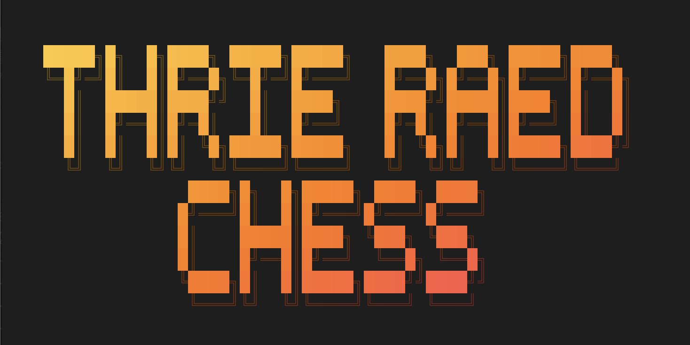
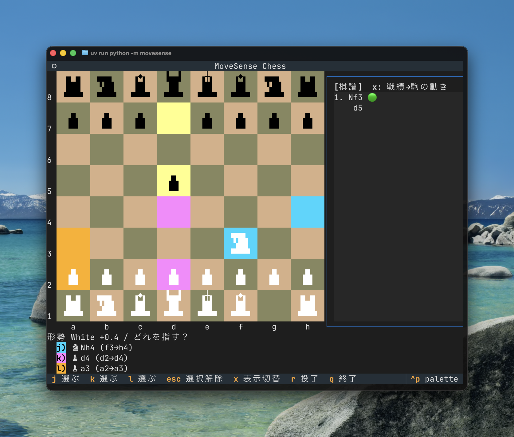
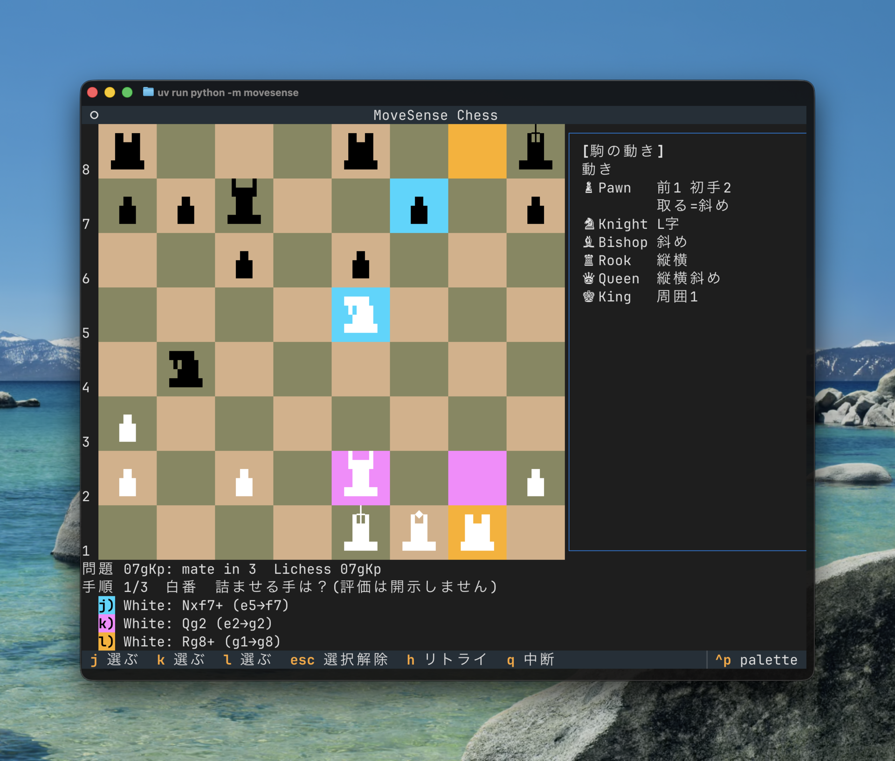

<p align="center">
  
</p>

<p align="center">
  A terminal (TUI) chess trainer for beginners — learn by choosing, not by searching<br>
  <a href="README.md">日本語版はこちら / Japanese version</a>
</p>

Instead of finding moves from scratch, you learn by picking the best move out of **three choices**. Built with [Textual](https://textual.textualize.io/) and [python-chess](https://python-chess.readthedocs.io/).

## Features

- **Battle mode** — play against a CPU opponent. Choose from five difficulty levels (Beginner, Novice, Intermediate, Advanced, Strongest) at the start with `h` / `j` / `k` / `l` / `;`. On each of your turns, Stockfish proposes three candidate moves; pick one with a single key (`j` / `k` / `l`). Your choice is graded green (near-best), yellow, or red by centipawn loss, with running stats.
- **Coach comments** — an encouraging coach reacts to every move you make: best moves get showered with praise, and even blunders are met with positive encouragement. Comments adapt to the game phase (opening / middlegame / endgame), the nature of the move (captures, checks, etc.), and winning streaks — phrased differently every time.
- **Puzzle mode** — mate-in-2/3/4 puzzles from the Lichess puzzle database, presented as 3-choice quizzes.
- **Game review export** — export the finished game as a PGN-based review prompt you can paste into an AI assistant.
- Block-art chess pieces rendered right in your terminal.

### Battle mode

Play a CPU and learn the best move via 3 choices:



### Puzzle mode

Find the mating sequence via 3 choices:



## Requirements

- Python 3.11+
- Terminal: **92×30 or larger** recommended (smaller sizes work, but the side panel narrows and pieces fall back to compact display)
- [Stockfish](https://stockfishchess.org/) on your `PATH` (required for battle mode; puzzle mode works without it)
  - macOS: `brew install stockfish`
  - Debian/Ubuntu: `apt install stockfish`

## Installation

With [uv](https://docs.astral.sh/uv/):

```sh
git clone https://github.com/hnsol/thrie-raed-chess.git
cd thrie-raed-chess
uv sync
```

## Usage

```sh
uv run python -m thrie_raed_chess
```

Or, after installing the package (`uv tool install .` or `pip install .`):

```sh
thrie-raed-chess
```

### Keys

- `j` / `k` / `l` — pick the left / middle / right choice
- `q` — back / quit

## Development

```sh
uv sync
uv run pytest
```

### Regenerating the bundled puzzles

The puzzles in `thrie_raed_chess/data/puzzles.json` are extracted from the [Lichess puzzle database](https://database.lichess.org/#puzzles) (CC0):

```sh
zstd -dc lichess_db_puzzle.csv.zst | uv run python tools/extract_lichess_puzzles.py thrie_raed_chess/data/puzzles.json
```

## License

MIT — see [LICENSE](LICENSE). Third-party attributions (Lichess puzzle database, chess-tui glyphs) are listed in [THIRD_PARTY_LICENSES](THIRD_PARTY_LICENSES).
