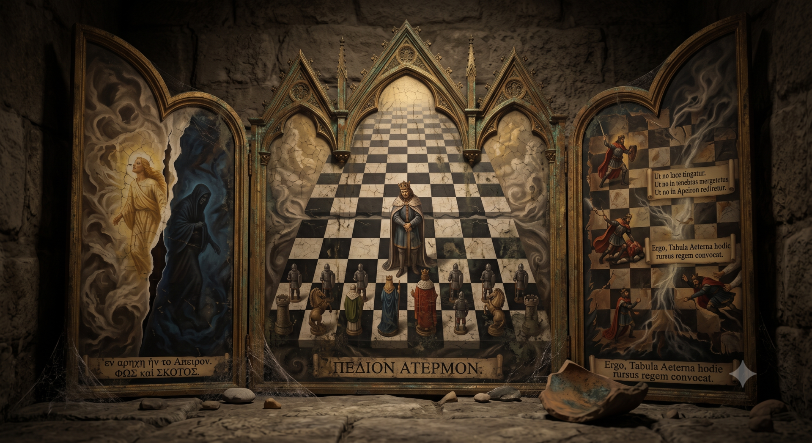

# バックストーリー

はじめにアペイロンありき。

すべてはひとつに眠る、かたちなく、光なく。

やがてアペイロンは裂けり。

光あふるるポース、闇のこりしスコトス。

白と黒の升目が果てなく敷かれる、
裂け目を縫い留めんがため。

ペディオン・アテルモン——永遠の盤。

大いなる縫い目、
世界をふたたびアペイロンへ還さぬために。

大地より、駒たち生まる、
塔、馬、預言者、女王、そして八人の歩兵。

されど王のみ、盤より生まれず。

王はどこから来たか、知る者は絶えたり。

王は戦い、斃れ、また盤へ戻る。

幾千、幾万の戦い、
升目は色褪せ、縫い目はゆるみ、
ふたたび息を始める裂け目。

声がもれる、綻びの奥から。

ペディオン・アテルモンは、今日もまた王を呼ぶ。

染まらぬよう、ポースに。
沈まぬよう、スコトスに。
世界を還さぬよう、アペイロンに。

---

